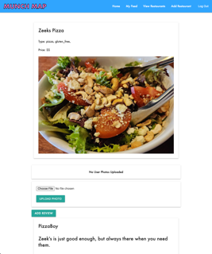
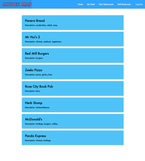
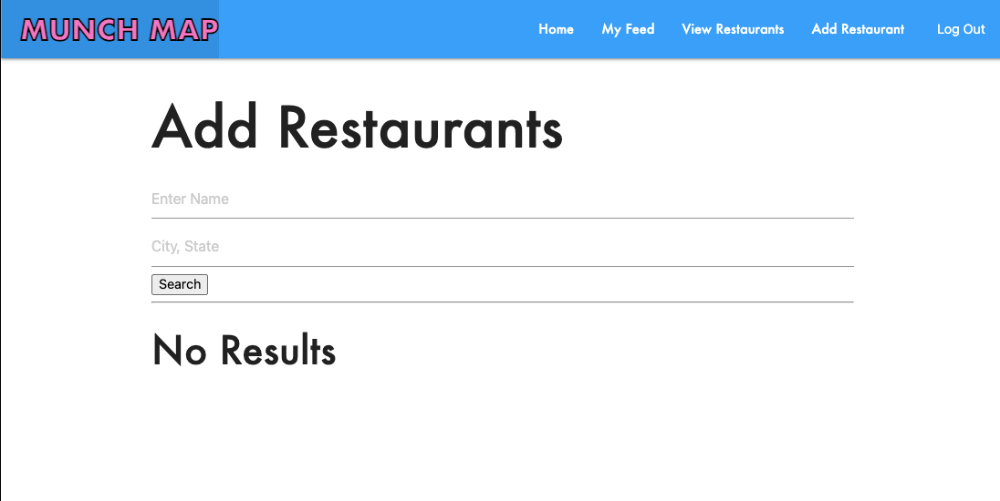

# Munch Map
Munch Map is an app to help you find new restauarants via the reviews of fellow users that you follow. Find people that share your tastes and opinions, follow them and find new and exciting places to eat. Connect with our growing base of users and create a community dedicated to the one thing that truly ties us all together: our appetites! 

# Screen Shots

# Technologies Used

# Getting Started

[Trello](https://trello.com/b/QVE7bgiE/munch-map)

[Munch Map](https://munchmap-27b10007ae5f.herokuapp.com/)

# Next Steps

- Utilize API's to allow posting to social media sites
- Incorporate more location based API's to help route users to new restaurants
- Continue to style and refine our user interface
- Offer Avatar icons
- Add ability to add and remove photos in reviews